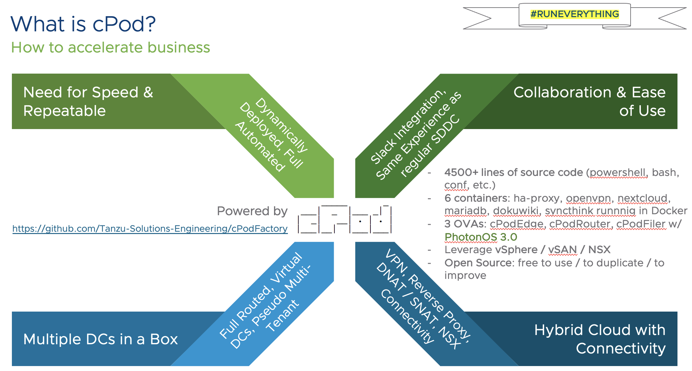

# cPod Factory

Lab Automation in nested VMware SDDC with ludicrous speed.
Like Russian Matryoska Dolls for virtual SDDC.



## Download links to bootstrap your environment:

- [Container used for executing powercli if you are airgapped](https://bucket-garage.s3.eu-central-1.amazonaws.com/powercli-container.tar.gz)
- [cPodEdge OVA](https://bucket-garage.s3.eu-central-1.amazonaws.com/template-cPodEdge-20200909.ova)
- [cPodRouter OVA](https://bucket-garage.s3.eu-central-1.amazonaws.com/template-cPodRouter-20200909.ova)
- [ESX70b template with trial license](https://bucket-garage.s3.eu-central-1.amazonaws.com/template-ESX70b-20200909.ova.gz)
- [FORTY-TWO template -  a Ubuntu jumpbox](https://bucket-garage.s3.eu-central-1.amazonaws.com/template-FORTY-TWO.ova)

**The purpose for this repository is to be used in Labs environments.**

_Powered by vSphere. Do not use for production environments!_

## Contribution Guidelines

First of all, **thanks a lot for your willingness to contribute** :thumbsup:

In order to have multiple actors working on this helpful resource, please follow our contribution guidelines.

### Setup for public contributors

* You are not allowed to commit changes directly to this repository 
* Please [fork](https://github.com/Turbots/cPodFactory/fork) this repository to your Github account and make changes there ([Tutorial](https://docs.github.com/en/get-started/quickstart/fork-a-repo)):
  * `git clone` the fork locally: `git clone git@github.com:vEDW/cPodFactory.git`
    * Change into the directory using `cd cPodFactory`
  * Rename your fork from e.g. `origin` to `your_username`: `git remote rename origin your_username`
  * Add the original repository as well, to `fetch` and `pull` changes from `origin` (changes caused by e.g. contributions from others): `git remote add origin https://github.com/Tanzu-Solutions-Engineering/cPodFactory.git`
  * Execute `git remote -v` to see both repositories

You should see a similar output like this:

```bash
git remote -v
vEDW	git@github.com:vEDW/cPodFactory.git (fetch)
vEDW	git@github.com:vEDW/cPodFactory.git (push)
origin  git@github.com:Tanzu-Solutions-Engineering/cPodFactory.git (fetch)
origin  git@github.com:Tanzu-Solutions-Engineering/cPodFactory.git (push)
```

### Contributions

- Please always use Github Issues to document your work. Example: [Issue-2](https://github.com/Tanzu-Solutions-Engineering/cPodFactory/issues/2)
  - Assign contributors to the issue
  - Use labels like e.g. `WIP` or `documentation`

- Name branches after the appropriate issue: `git checkout -b issue-2`
  - Start working within the branch (don't forget to check out if you are working on multiple branches!)

- When you finished working on an issue, and you'd like to push it to your fork, to ultimately open a Pull Request at `origin` follow the example:
  * Stage all changes which you'd like to `commit` and `push`
  * Follow Git commit [best practices](https://cbea.ms/git-commit/)
  * A commit message can address an issue directly. Make use of it! `git commit -s - m "your commit message" -m "Closes: #2"`
    * By appending `-m "Closes: #2"` to your commit, it'll automatically close it finally

> Sign your commits! The e-mail address used to sign must match the e-mail address of the Git author. If you set your `user.name` and `user.email` git config values, you can sign your commit automatically with `git commit -s`.

I highly recommend reading this awesome [BLOG POST on Git](https://www.mgasch.com/2021/05/git-basics/) by [Michael Gasch](https://twitter.com/embano1) when you are in trouble.

Finally, merge your branch if you've finished working on it. `git merge issue-2`

Read the [User Manual](docs/usermanual.md) for more information.

Check out the [LICENSE](./LICENSE).
