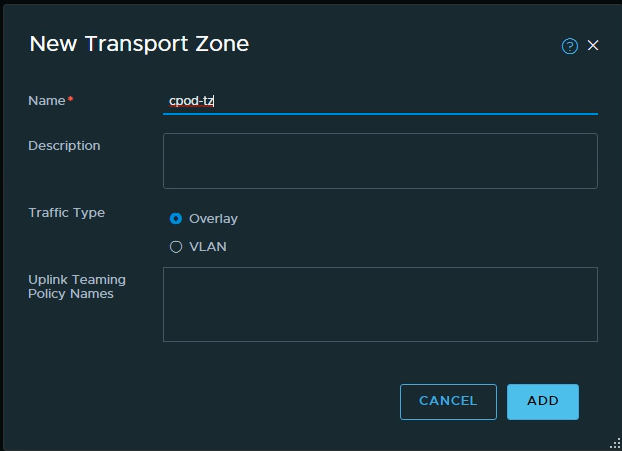
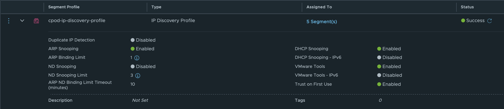
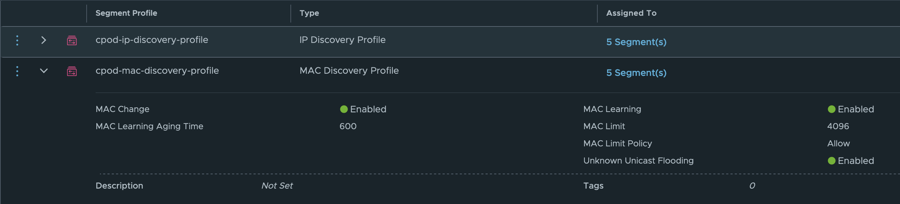
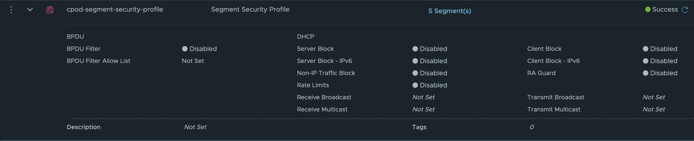

# How to deploy new cpodfactory

## infra preparation

### choose network design
you can choose between VDS/VLAN or NSX-T overlay.
if you have access to switches and you can define vlans, choose VDS/VLAN setup. This will give you best network performance.

If you don't have switch access, or you are very limited with regards to ip management, choose NSX-T setup.

### VDS - VLAN setup

TBD

### NSX-T setup

rem : if nsx-t is vidm integrated, check KB : https://kb.vmware.com/s/article/75273

#### create transport zones

NSX-t manager -> System -> Fabric/Transport Zones section -> Transport Zones -> "ADD Zone"



#### create uplink profile

NSX-t manager -> System -> Fabric/Profiles section -> Profiles -> "ADD Zone"


#### create segment profiles

NSX-t manager -> Networking tab -> Segments section -> profiles -> "ADD  Profile" button

name: host-profile
active uplink: uplink-1
VLAN: depending on infra setup

(image to be added)

#### create transport node profiles

NSX-t manager -> System -> Fabric/hosts section -> transport node profiles -> "ADD TRANSPORT NODE PROFILE"

name: host-transportnode-profile
host switch: select VDS
TZ : cpod-tz
uplink profile: host-profile

(image to be added)

#### cpod-ip-discovery-profile

name: cpod-ip-discovery-profile
type: IP Discovery Profile 
features selection: default settings



####  cpod-mac-discovery-profile 

name: cpod-mac-discovery-profile 
type: MAC Discovery Profile 
features selection: 
  * MAC Change : enabled
  * MAC Learning : enabled



####  cpod-segment-security-profile

name: cpod-segment-security-profile 
type: Segment Security Profile 
features selection: disable all



#### create network segments

create following portgroups on VDS (not NSX!)
* Dummy 

create the following Segment on NSX-T
* cpod-transit (VNI)


## vCenter configurations

you must have a vsphere cluster with DRS/HA/VSAN(opt) setup.

### create Resource Pools

create 2 Resource pools:
* cPod-Management
* cPod-Workload

### Create VM folders
* Management
* Template

## cpodedge deploy
clone existing cpodedge or download from S3 bucket.

### add storage to cpodedge as needed

add disk to cpodedge vm (i.e. 500GB)

then execute following commands via ssh:
```
fdisk -l
``` 
result :

```
Disk /dev/sdb: 300 GiB, 322122547200 bytes, 629145600 sectors
Units: sectors of 1 * 512 = 512 bytes
Sector size (logical/physical): 512 bytes / 512 bytes
I/O size (minimum/optimal): 512 bytes / 512 bytes
```

partition and format the disk

```
fdisk /dev/sdb
n (new partition)
p (primary)
<enter> (default start)
<enter>
<enter>
p (to check partiotion is ok and type Linux)

w (to write partition table and leave fdisk)

mkfs.ext4 /dev/sdb
```

edit /etc/fstab accordingly
```

```


### storage setup


### network setup
cpodedge interfaces:
* eth0 - Management
* eth1 - internet egress
* eth2 - cpod_transit (VNI)
* eth3 - NSX-TEP (opt)

configure cpodedge network interfaces:

```
>ls /etc/systemd/network/
eth0-static.network  eth1-static.network  eth2-static.network  eth3-static.network
```

configure iptables for wg0 and related routes if required
cat /etc/systemd/scripts/iptables

```
...
### WireGuard
#modprobe udp_tunnel
#modprobe ip6_udp_tunnel
#insmod /lib/modules/4.19.97-1.ph3-esx/extra/wireguard.ko
modprobe wireguard
ip link add wg0 type wireguard
ip link set mtu 1500 dev wg0
ip a add 10.255.253.11/24 dev wg0
wg setconf wg0 /etc/wireguard.conf
ip link set up dev wg0
...

# to  clb
ip route add 172.25.0.0/16 via 10.255.253.4
ip route add 172.24.10.0/24 via 10.255.253.4
#ip route add 172.17.0.0/16 via 10.255.253.4 dev wg0
#ip route add 172.24.10.0/24 via 10.255.253.4 dev wg0
#ip route add 172.25.0.0/16 via 10.255.253.4 dev wg0
...

```

# create new wireguard config

mkdir /etc/wireguard
cd /etc/wireguard
wg genkey | tee private.key
cat private.key | wg pubkey | tee public.key

get ip of eth1


modify /etc/hosts on cpodedge for cpodfactory environment
(example)
```
# Begin /etc/hosts (network card version)

::1         ipv6-localhost ipv6-loopback
127.0.0.1   localhost.localdomain
127.0.0.1   localhost
127.0.0.1   cPodEdge
# End /etc/hosts (network card version)
10.197.96.201	cpodedge
10.202.121.121	cpodbuild
10.197.96.202	vcsa
10.197.96.203	nsx
#10.202.121.138	rift
10.197.96.111	forty-two
#10.202.121.136	forty-three
#10.202.121.137	wireguard
#10.202.121.124-126 ESX-TEP

10.197.96.202	vcsa.az-wdc.cloud-garage.net
10.197.96.203   nsx.az-wdc.cloud-garage.net
10.202.121.122	vcsa.az-stc.cloud-garage.net
10.202.121.123	nsc.az-stc.cloud-garage.net
```

modify bgpd.conf for your cpodfactory:

```
>>> cloud-garage | az-stc <<<
root@cpodedge [ ~/cPodFactory ]# cat /etc/quagga/bgpd.conf
!
! Zebra configuration saved from vty
!   2022/11/21 08:20:17
!
hostname cPodEdge
password VMware1!
enable password VMware1!
log stdout
!
router bgp 65500
 bgp router-id 10.202.121.120
 redistribute connected
 neighbor 10.202.121.137 remote-as 64000
 neighbor 10.202.121.137 password VMware1!
 neighbor 172.16.2.11 remote-as 65511
 neighbor 172.16.2.12 remote-as 65512
 neighbor 172.16.2.13 remote-as 65513
 neighbor 172.16.2.14 remote-as 65514
 neighbor 172.16.2.17 remote-as 65517
!
 address-family ipv6
 exit-address-family
 exit
!
access-list all permit any
!
line vty
!

```

modify /etc/dnsmasq.conf to your cpodfactory settings:
```
...
domain=az-wdc.cloud-garage.net
local=/az-wdc.cloud-garage.net/
...
server=/cpod-start.az-wdc.cloud-garage.net/172.16.2.10
```

### cpodfactory env setup

modify cPodFactory/env to define your cPodfactory

```
case $WHERE in
	"172.16.100.50/22")
		ALL_CLUSTER=(lab)
		;;
	"172.16.100.20/22")
```

create and modify env-<cpodfactory> in cPodfactory folder

```
root@cpodedge [ ~/cPodFactory ]# ls env-*
env-dell  env-dxb  env-fkd  env-hp  env-intel  env-mad  env-ovh  env-stc  env-techdata 
```

### profile and motd

modify:
* /etc/motd
* /etc/profile

```
>>> cloud-garage | az-wdc <<<
root@cpodedge [ ~ ]# cat /etc/motd

     _____       _ _____   _
 ___|  _  |___ _| |   __|_| |___ ___
|  _|   __| . | . |   __| . | . | -_|
|___|__|  |___|___|_____|___|_  |___|
                            |___|
@wdc | az-wdc
```

```
...
if [[ $EUID == 0 ]] ; then
  PS1="\n${GREEN}>>> cloud-garage | az-wdc <<<\n$RED\u@\h [ $NORMAL\w$RED ]#${NORMAL} "
else
  PS1="$GREEN\u@\h [ $NORMAL\w$GREEN ]\$ $NORMAL"
fi
...
```

### portgroup creation script

modify : [./compute/modify_portgroup.ps1](../compute/modify_portgroup.ps1)
if you need to specify uplinks teamingpolicy specifically for your cpodfactory.

```
switch ($Spec) {

...
	"FKD" {
		Get-VDPortgroup $Portgroup | Get-VDUplinkTeamingPolicy | Set-VDUplinkTeamingPolicy -ActiveUplinkPort "uplink2" -StandbyUplinkPort "uplink1"
		Break
	}
...

}
```

## cpodrouter settings

boot template-cpodrouter and connect to console


modify:
* /etc/systemd/network/eth1-static.network
* ~/update/eth1-static.network
* ~/update/bgpd.conf
* ~/update/dnsmasq.conf
* ~/update.update.sh

update /etc/systemd/network/eth1-static.network
```
[Match]
Name=eth1

[Network]
Address=172.xx.xx.254/24		<= based on TRANSIT_NET in env-xxx
Gateway=172.xx.xx.1				<= cpodedge eth2 ip

[DHCP]
UseDNS=false
```


update /update/eth1-static.network
```
Gateway=172.16.2.1 ==> replace "172.16.2.1" by corresponding cpodedge ip on cpodtransit (eth2 value) 
```

/update/bgpd.conf 
```
replace "neighbor 172.16.2.1" by corresponding cpodedge ip on cpodtransit (eth2 value) 
```

/update/dnsmasq.conf 
```
replace "172.16.2.1" by corresponding cpodedge ip on cpodtransit (eth2 value) 
```

/update.update.sh - NET_INT must be same as "TRANSIT=" in env-<cpodfactory>
```
...
### Constant
NET_INT="172.24"
...
```

when deployed the cpodrouter update.sh will modify the following files:

```
### Files to be modified
# /etc/hostname
# /etc/hosts
# /etc/dnsmasq.conf
# /etc/exports
# /etc/motd & /etc/issue
# /etc/quagga/bgpd.conf
# /etc/systemd/networkd/eth0-static.network
# /etc/systemd/networkd/eth1-static.network
# /etc/nginx/nginx.conf
# /etc/nginx/html/index.html
```

update /etc/ntp.conf with appropriate value for NTP server for your new environment.

```
tinker panic 0
restrict default kod nomodify notrap nopeer noquery
restrict 127.0.0.1
restrict -6 ::1
driftfile /var/lib/ntp/drift/ntp.drift
server ntp.vmware.com iburst
```

## ESXi settings for nested vsan cpods

once all is configured, run the following command on cpodedge:
```
./install/V2SAN/modify_esxi.sh
```
