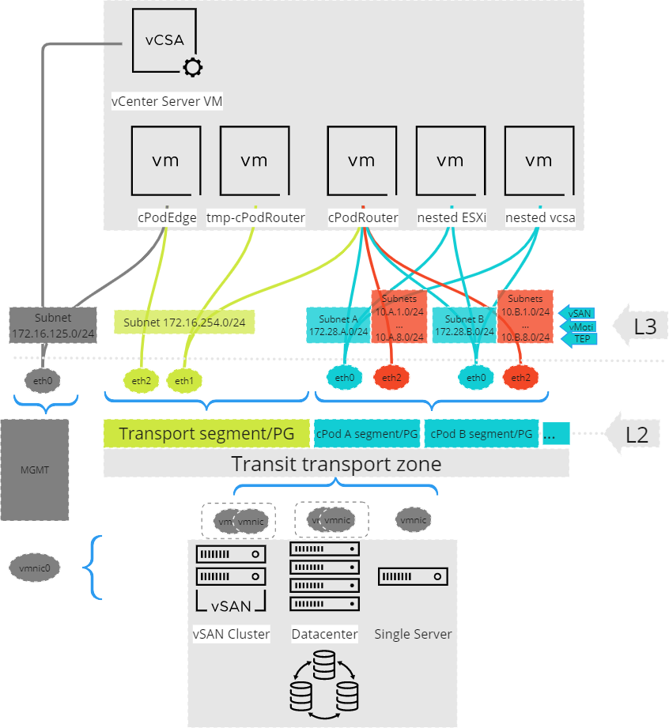

# Let's start with cPodFactory

Welcome to the cPodFactory!

This is the starting point of understanding how to use cPods in your nested environment. Here you will get overview of the components that are essential. As next you see a basic diagram of the solution. 

----
## The cPodFactory components

The basic components of cPodFactory are:

*	**cPodEdge** is a virtual appliance. It is the core of cPodFactory. It is delivered as a OVA and can be downloaded from the central server. It has Linux PhotonOS and some important services. The scripts that build the automation of cPodFactory are included in the OVA image. In addition you have all interfaces you will need to run commands on vSphere, VC, NSX, etc. After connecting and configuring the cPodFactory you will use the `cpodctl` to create new cPods.
	*	The **Network Interfaces** mapping from cPodEdge:
		* **eht0** connects to the **Management** network
		* **eth2** connects to the **Transit transport zone**, which includes the `vmnic` **physical NICs** from all ESXi hosts or transport nodes. This transport zone type can be can be either **overlay** or **VLAN**. NSX (T or V) can used for both the overlay and VLAN option. VLAN Trunk in a VDS Switch can be used for simple VLAN transport zone too. The transport zone normally consists of multiple network segments, which are groups of virtual ports (port groups in VDS). The initial network segment **Transit network segment** connects **eth2** from cPodEdge with all **eth0** cpodRouters including the template and service cpod. It is configured with the following properties: `-EnableMacLearn $true -EnableForgedTransmit $true -EnableMacChange $true -EnablePromiscuous $false`.  Refer to the setup steps in the documentation and the [L2/L3 diagram](#diagram2) .
		* **eth1** connects to the **external/Internet** network. This can connect to wireguard and openVPN container within the cPodEge if you don't have access over the management network
		* **eth3** not used often. It can offer some services like DHCP. For example to set IPs from NSX TEP interfaces 
	*	**DNSMASQ** service offers local DNS to the cPodFactory and connection to upstream DNS servers in your data center. In addition offers optional DHCP server.
	*	**docker** service offers the ability to run containers like OpenVPN and wiregard.
*	**cPodRouter** is another virtual appliance. cPodRouters will be dynamically created from cPodRouter template and every cPod (nested environment) will have its own cPodRouter. cPodRouters will be routed together with eBGP and the owners from cPods can interconnect their services.
	* **template-cPodRouter** is created during the initial configuration. All future cPods will get their cPodRouters from it. The eth0 is not connected to any Subnet.
*	The **Transit network segment** is the subnetwork that is created to connect cPodRouters. During the configuration phase a subnet has to be selected that fulfill this purpose. The cPodEdge is the Gateway in that subnet and is set with the parameter `TRANSIT_GW="254.1"`, that set the subnetwork and the IP from the eth2 interface from cPodEdge.
*	The **cPODs network segments** are the segents that cPods will share. They are created as part of the **Transit transport zone**. Those network segments share subnet space defined with the parameter `TRANSIT=` and is usually Class B /16 network. If the Netmask in the cPodRouter is set to `255.255.255.0` each cPods will get  Class C /24 nested subnet.

