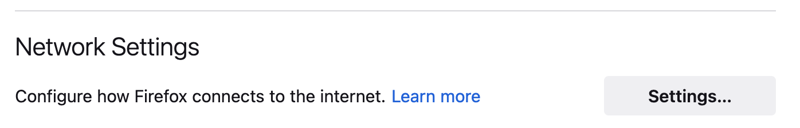
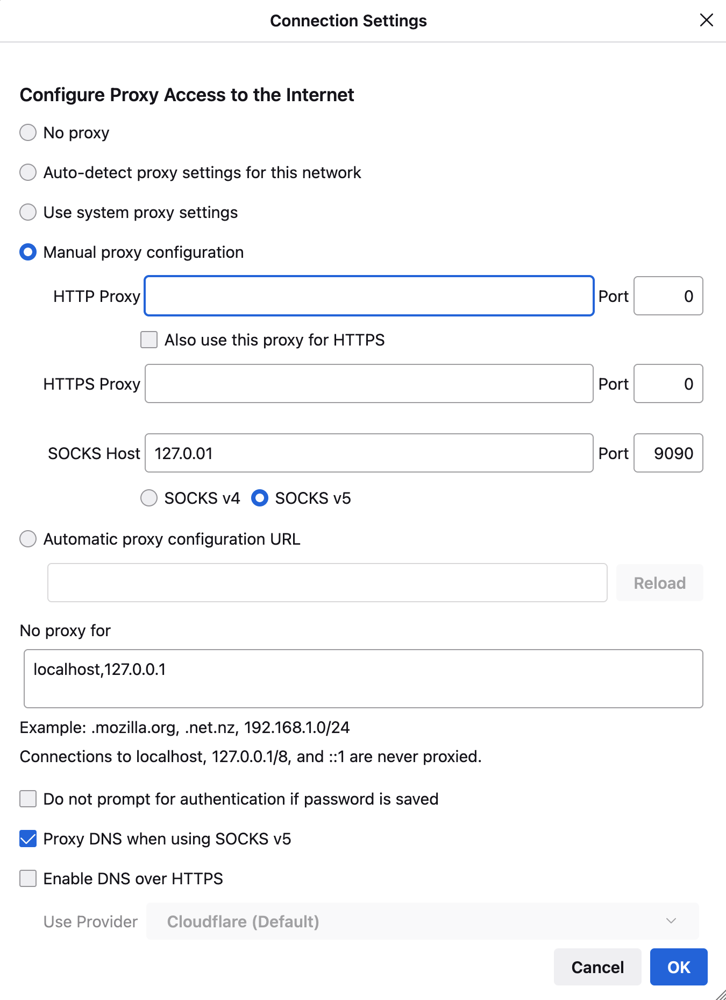

# cPodFactory User manual

## Using cPodFactory

### create a new cPod

Before you begin it is not recommended to  deploy cPods directly over your SSH session. Instead use a window manager such as tmux to perform the deploys.

To start a new session from the shell:
```shell
~$ tmux new -s <<session name>>
```

To exit your current session press ***Control-B*** followed by ***d*** (detatch)

## connecting to cPodFactory

Work with your cPodFactory Owner to get your ssh key added to the environment for access.

### connect using SSH tunnel

The least intrusive way to get connection to the cPodFactory network is through SSH tunnel and use of firefox browser which allows you to define network proxy settings at browser level instead of system level.

On your laptop, use the following command:
````shell
~$ ssh -D 9090 root@[cPodEdge IP]
````
example :
````shell
~$ ssh -D 9090 root@cpodedge-fkd.cloud-garage.net
````

then open firefox and set the following parameters :
under general - Network settings



set:
* "Manual Proxy" 
    * Socks Host = 127.0.0.1
    * Port : 9090
    * Socks version : v5
* No proxy for
    * "localhost, 127.0.0.1"
* enable
    * "Proxy DNS when using SOCKS v5"



